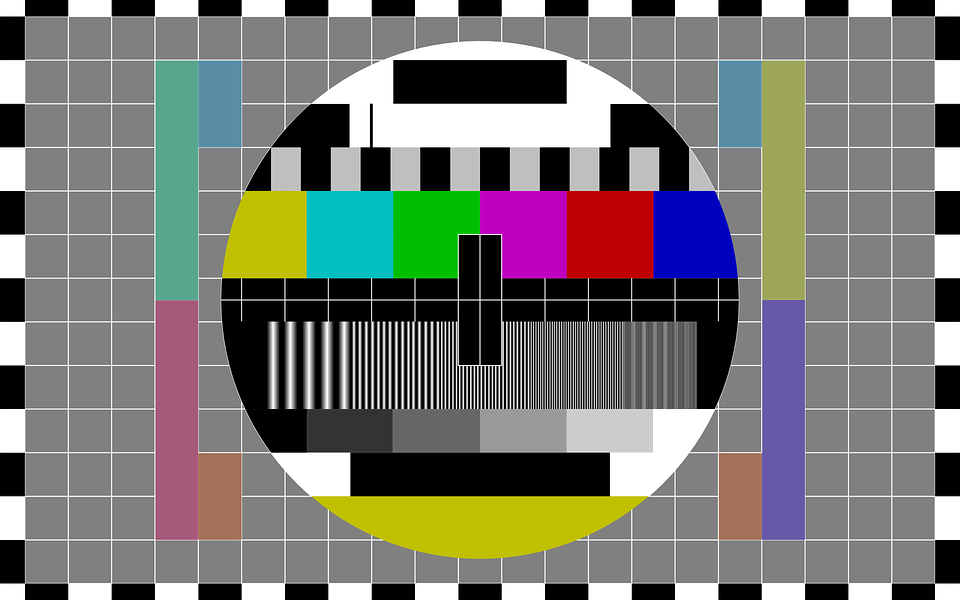
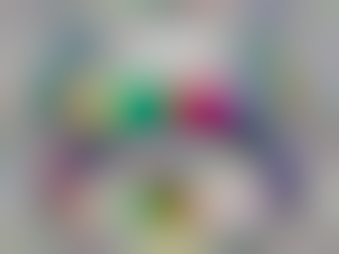

BlurHash CLI
------------

CLI tool for [BlurHash][1] with using of existed [implementation][2].


## Encode

```
Encode provided image in the blurhash string

Usage:
   encode [flags]

Flags:
  -a, --autodetect       Autodetect X/Y components numbers
  -x, --componentX int   Quantity of components by X axis (default 9)
  -y, --componentY int   Quantity of components by Y axis (default 9)
  -h, --help             help for encode
  -i, --input string     Path for the input image
```

### Examples:

Lets encode the input [image](assets/input.png).



- Autodetected components ratio:
```shell
blurhash-cli encode -a -i ./assets/input.png
```
- Manual components ratio (for our example its 9x6):
```shell
blurhash-cli encode -x 9 -y 6 -i ./assets/input.png
```

As a result for our input image we will get the next hash string:
```
rAG+UJS[N4#G?ZGD-;#mWBt-XSIlVa-Et3R5xCS5~pi%9HTWj:#Aa$OEWBRCies:pZNZm:x?E*R*D%tQ-:MyWBozIUs:j?V=XM%Nvo9ZKN%MwJs:
```


# Decode

```
Decode provided blurhash string into image

Usage:
   decode [flags]

Flags:
      --hash string     String is represented BlurHash code
      --height int      Height of the output image (default 64)
  -h, --help            help for decode
  -o, --output string   Path for the output image
      --punch int       Intensity of colors in resulted image (default 1)
      --width int       Width of the output image (default 64)
```

### Examples:
- Manually set the output ratio:
```shell
blurhash-cli decode --hash='rAG+UJS[N4#G?ZGD-;#mWBt-XSIlVa-Et3R5xCS5~pi%9HTWj:#Aa$OEWBRCies:pZNZm:x?E*R*D%tQ-:MyWBozIUs:j?V=XM%Nvo9ZKN%MwJs:' --height=480 --width=360 --punch=1 -o ./assets/output.png
```

So as a result we will get the PNG [image](assets/output.png).




---
## Note

Only PNG format is supported now.

---


[1]: https://blurha.sh/

[2]: https://github.com/bbrks/go-blurhash